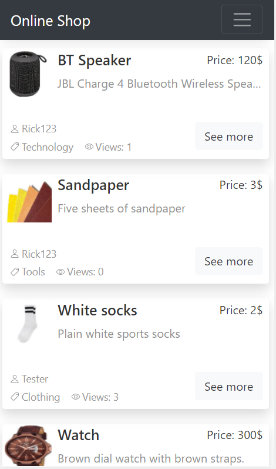

# Online Shop
> Online Shop built with ReactJS and Firebase

## Table of contents
* [Technologies](#technologies)
* [Screenshots](#screenshots)
* [Features](#features)
* [Status](#status)

## Technologies
* ReactJS
* Bootstrap / CSS
* Firebase

## Screenshots

## Features
List of features ready and TODOs for future development
* User Authentification (Register, Login, Log-Out, Reset Password, User name)
* User Account Setings (Change name, email, passoword, delete account)
* Pagination displaying 10 ads per page
* Filter ads by user and category
* Add, update and remove ads
* Breadcrumbs in navigation

To-do list:
* Add tests
* Refactor Code
* Adapt design for all screen sizes
* Add other methods of signing in (Facebook, Google etc.)

## Status
Project is: In Progress 
